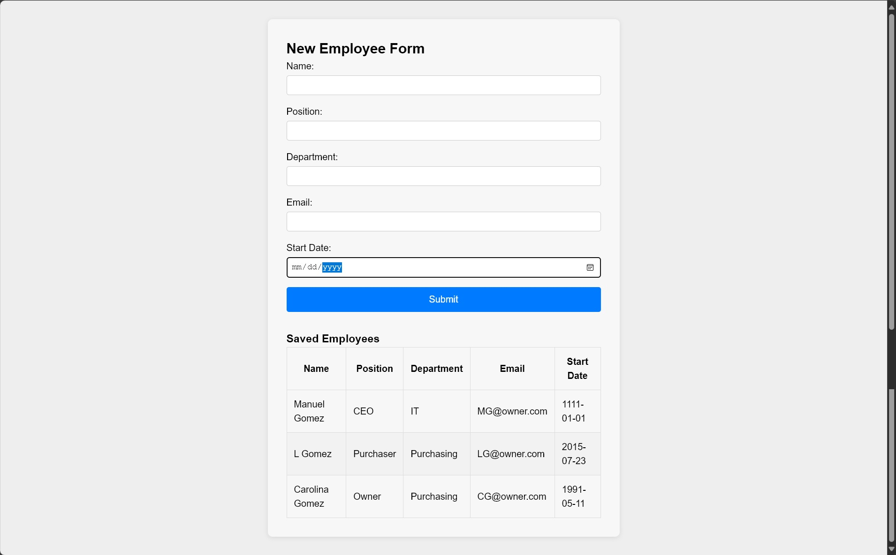

# Week 3 Project: React Employee Form with Local Storage

This project implements a simple React application where you can add new employees via a form and have the entries persist in your browser’s local storage.  

## Getting Started

Clone the repo and run:

```bash
npm install
npm start

## "C:\Users\gomez\OneDrive - University of Arizona Global Campus\Desktop\React Projects\week3project\public\completion.jpg"

Below is how the form looks after submitting employees (data persisted via localStorage):


